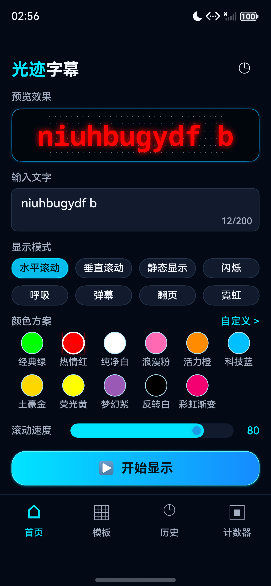
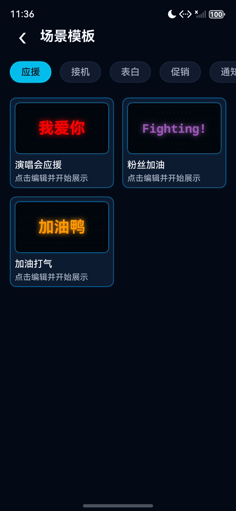
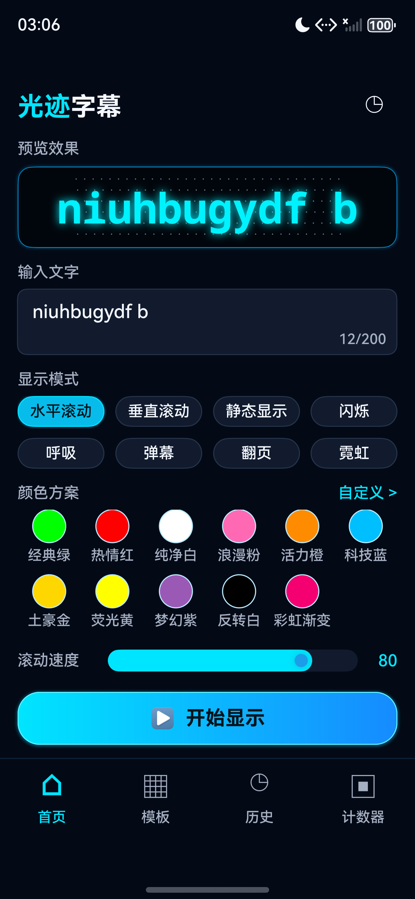
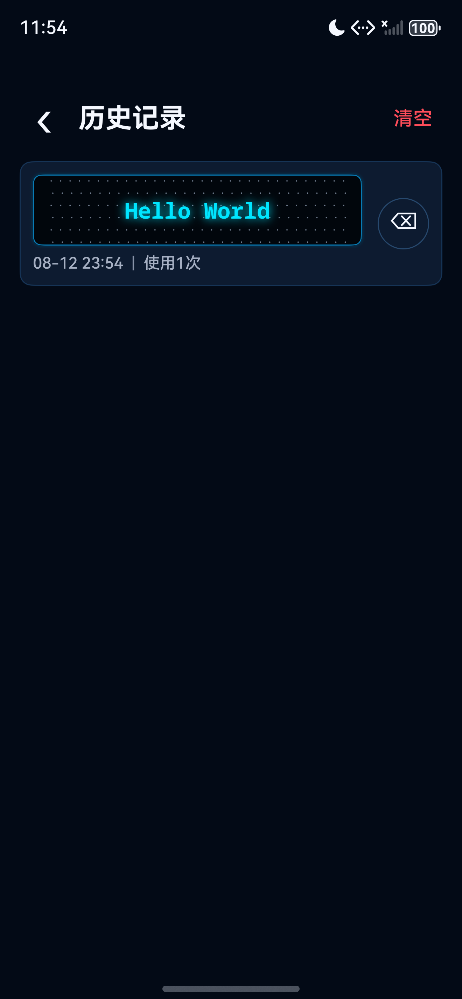
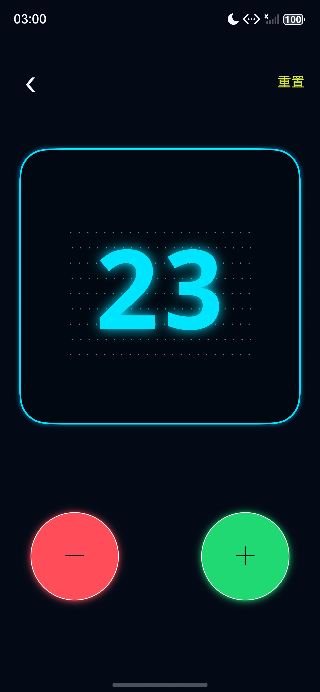
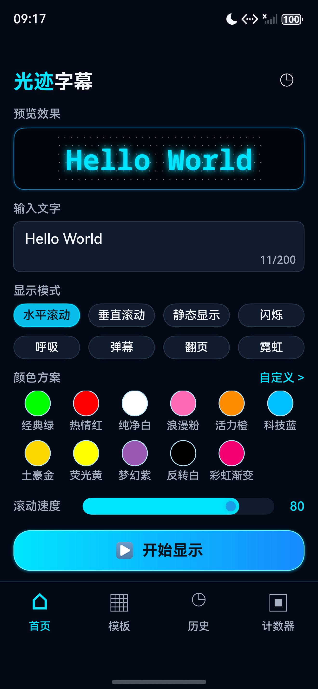

# 光迹字幕

把手机屏幕变成可自定义的 LED 滚动字幕牌：输入文字即可实时预览，进入全屏后自动隐藏系统栏、保持常亮并把亮度拉满。应用无需登录、不依赖网络，配置、模板与历史只保存在本机。

## 技术栈

- HarmonyOS，兼容与目标 SDK `6.0.2(22)`，`runtimeOS` 为 HarmonyOS，Stage 模型
- ArkTS / ArkUI 声明式 UI，`entry` 单 HAP 模块；`AppScope/app.json5` 另声明 `minAPIVersion` 12、`targetAPIVersion` 16
- 设备类型：phone、tablet、2in1（同一份代码按 600vp / 840vp 断点重排）
- 无第三方依赖；测试依赖 `@ohos.hypium` `1.0.28`
- 本地持久化：`@kit.ArkData` Preferences（库名 `led_banner_store`），历史、上次配置、自定义颜色均以 JSON 字符串读写，写操作串行排队并先校验再落盘
- 窗口能力：`@kit.ArkUI` window 的 setPreferredOrientation / setWindowLayoutFullScreen / setWindowSystemBarEnable / setWindowKeepScreenOn / setWindowBrightness，由 ScreenService 统一管理
- 备份：EntryBackupAbility 备份扩展已声明，`backup_config.json` 中 allowToBackupRestore 当前为 false，即不参与系统备份

## 功能特性

**文字与实时预览**

- 输入文字上限 200 字符，输入同时在点阵预览面板中实时呈现效果并显示字数
- 首页集中配置显示模式、配色、速度、字体大小与三项开关，全部状态实时驱动预览

**八种显示模式**

- 水平滚动、垂直滚动、静态显示、闪烁、呼吸、弹幕、翻页、霓虹
- 速度以 0-100 滑杆映射到 5 档，每档为各模式独立的时间参数（如滚动 12s-1.5s、闪烁 2000ms-300ms）
- 弹幕模式同时发射 5 行、每行速度系数不同且依次延迟入场
- 翻页模式按换行拆分文本逐行切换，单行文本视为静态显示

**全屏展示**

- 全屏展示隐藏状态栏与导航栏、保持屏幕常亮，并把屏幕亮度设为最高
- 单击显示退出按钮，3 秒后自动隐藏；双击暂停/继续动画，暂停时界面显示「已暂停」
- 首次进入展示页显示 3 秒操作引导；切到后台自动暂停，返回前台恢复播放
- 「横屏显示」开关决定展示页请求横屏还是竖屏；离开展示页统一恢复自动方向、标准安全区、系统栏配色、自动亮度与正常息屏策略

**配色与外观**

- 11 个预设色样：经典绿、热情红、纯净白、浪漫粉、活力橙、科技蓝、土豪金、荧光黄、梦幻紫、反转白、彩虹渐变
- 自定义颜色页提供 0-360 度色相滑杆、饱和度与明度滑杆、RGB 数值输入，HSV 与 RGB 双向换算，最近使用的颜色最多保留 10 个
- 字体大小 30-200 可调；「镜像翻转」便于隔着玻璃阅读，「边框装饰」为全屏画面加固定边框
- 深色视觉方案：页面底色 `#030A16`、青色主强调 `#00E5FF`，视觉令牌集中在 `common/Theme.ets`

**可读性与展示安全**

- 内置 sRGB 相对亮度与对比度计算，点阵预览和全屏字幕都会在渲染时校正文字色：与背景对比度不足 4.5:1 时自动改用黑色或白色，彩虹、霓虹这类逐帧变色也逐帧校正
- 呼吸与闪烁改用轻微缩放动效，不再用整体透明度做动画，避免动画过程中文字落到可读阈值以下
- 全屏字幕使用等宽字体加投影，超长文本按单行省略号收敛

**场景模板**

- 六个分类共 15 个内置模板：应援、接机、表白、促销、通知、互动
- 模板卡片按宽度在 2 / 3 / 4 列之间切换
- 使用模板前可修改文字、字体大小与速度，确认后直接进入全屏展示并写入历史

**历史、计数器与偏好**

- 历史记录按文字去重，保留最近 20 条，显示最后使用时间与使用次数，删除单条与清空都需要二次确认
- 计数器模式提供 + / - 按钮、点阵大数字与二次确认的重置，支持负数，数值持久化到本地
- 上次使用的配置在启动时自动恢复
- 进入展示页时先把配置路由过去，再在后台合并写入上次配置与历史并只做一次落盘

## 截图

首页 · 输入文字、八种模式、十一个色样与三项开关



| 场景模板 | 自定义颜色 | 历史记录 |
| --- | --- | --- |
|  |  |  |

| 全屏展示 | 计数器 | 首页（另一轮回归） |
| --- | --- | --- |
|  |  |  |

截图取自 `docs/qa/`，为 127.0.0.1:5555 模拟器上的实际运行画面。场景模板一张拍摄于 2026-08-07，早于应用更名，页面标题仍是「场景模板」，功能与其他截图一致。模拟器只报告竖屏物理显示模式，横屏画布仍需在支持旋转的设备上复验，详见 [docs/superpowers/specs/2026-08-04-landscape-safe-area-design.md](docs/superpowers/specs/2026-08-04-landscape-safe-area-design.md)。

## 目录结构

```
AppScope/                   应用级配置、应用名与分层图标
entry/src/main/ets/
  entryability/             EntryAbility，窗口创建后应用系统栏主题
  entrybackupability/       备份扩展 Ability
  pages/                    首页、全屏展示、场景模板、历史、自定义颜色、计数器
  components/LedPanel.ets   复用的点阵预览面板
  services/                 ScreenService 窗口状态、AnimationService 动画参数、StorageService 持久化、TemplateService 模板库
  models/                   BannerConfig、ColorScheme、HistoryRecord、Template
  common/                   Theme 视觉令牌、Constants 尺寸与上限、Utils 对比度与颜色换算
  resources/base/profile/   main_pages.json 页面路由、backup_config.json 备份配置
docs/                       设计、QA 证据、release 提交材料与 superpowers 设计与实施记录
scripts/                    构建、标准检查、图标生成，以及 UI 合同/窗口布局/可访问性/展示安全与商店验收回归脚本
```

## 构建与运行

1. 用 DevEco Studio 打开仓库根目录，等待 HarmonyOS SDK 与依赖同步完成；工程为 Stage 模型单 `entry` 模块，compatibleSdkVersion / targetSdkVersion 均为 `6.0.2(22)`。
2. 选择 `entry` 模块与目标设备（模拟器或真机）后直接 Run，启动入口是 EntryAbility。
3. 首次运行请自行配置签名（build-profile.json5 的 signingConfigs 默认为空），否则只能产出 unsigned HAP。
4. 在首页输入文字并点击「开始显示」进入全屏，双击暂停/继续，单击唤出退出按钮。

命令行构建（Windows PowerShell，需已安装 DevEco Studio）：

```powershell
$env:DEVECO_SDK_HOME='C:\Program Files\Huawei\DevEco Studio\sdk'
.\scripts\build-harmony.ps1 -BuildMode debug
```

脚本会调用 hvigorw.bat 执行 assembleHap 并输出产物路径；结构、配置与文档检查可运行 .\scripts\check-standard.ps1。

## 隐私说明

- **不申请任何权限**：`entry/src/main/module.json5` 的 requestPermissions 为空数组，应用不读取网络、相机、位置、麦克风、通讯录或媒体文件。
- 无需登录、无网络请求、无云同步，用户输入的文字与历史记录不上传。
- 历史、上次配置与自定义颜色只写入当前设备的 Preferences；卸载应用会删除应用沙箱中的数据。
- 备份扩展当前配置为 allowToBackupRestore: false，应用数据不进入系统备份。

## 许可

`entry` 模块声明 Apache-2.0，仓库当前未附 LICENSE 文件；正式发布前建议补齐许可证正文。
